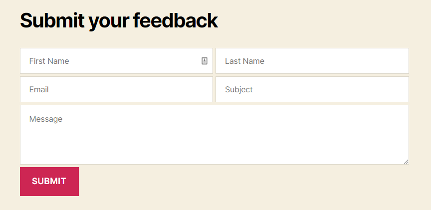

# Enquiry

WordPress plugin that provides 2 shortcodes: [enquiry_form] and [enquiry_results].

First shortcode renders enquiry form like below:

[enquiry_results] shortcode renders enquiry submission records in a paginated table:

Table's details expansion and pagination are implemented with AJAX.

